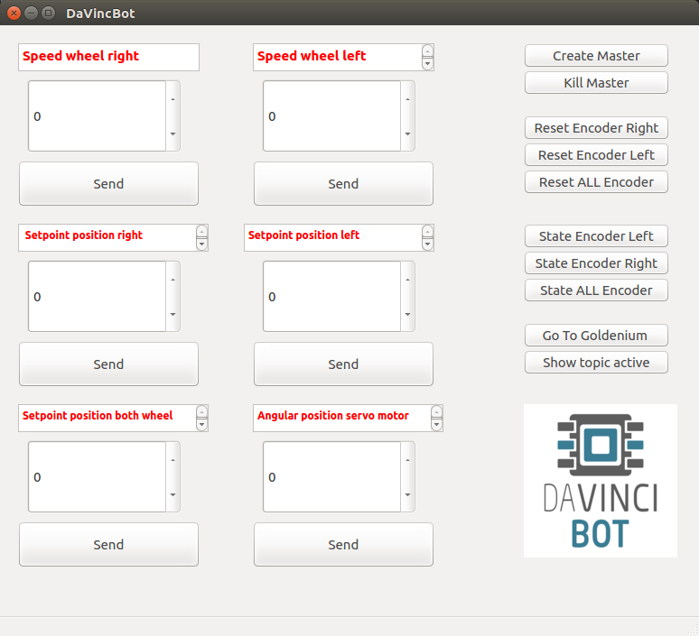

# Presentation
Project for the french cup of robotic 2019.
### **[Link to the website of the Competition](https://www.coupederobotique.fr/lacoupe/)**

This ROS stack includes an Arduino library and a collection of ROS packages for controlling an Arduino-based robot using standard ROS messages and services.

Features of the stack include:
- Controller Speed and Position using ROS PID 
- Control servo motor
- Direct support for Ping sonar
- GUI Interface for debugging the robot 

CAD            |  Real Word Robot
:-------------------------:|:-------------------------:
  |  

(CAO by [Johny Lin](https://github.com/JohnySparkFall))

Debugging Interfaces : 

# Hardware : 

- Pololu VNH5019 dual motor controller shield (http://www.pololu.com/catalog/product/2502) 
- Faulhaber 2642 cxr motor 
- Rotary encoder kubler X388741 
- Nucleo ESP32
- Arduino Uno (ATMEGA 328p)
- Raspberry Pi 3

# Installation Guide (Work in progress) 

First you need Ubuntu 16.04 with Ros Kinetic : [ROS kinetic](http://wiki.ros.org/kinetic)

    $ git clone [https://github.com/gabi22top/ROS_FrenchCupRobotic2019](https://github.com/gabi22top/ROS_FrenchCupRobotic2019)ter code here
    $ cd ~/cdr_robot_ws/
    $ catkin_make

For the debugging GUI you will need PYQT5

    $ sudo apt-get install python3-pyqt5

And just run the gui : 

    $ cd /Project Interface
    $ Python3 ./MainWindows.py

# More about the project :
### **[Link of the youtube video](https://www.youtube.com/watch?v=CekWTSOTMr8)**
### **[Association](http://davincibot.org/)**

Don't hesitate to contact me for more information about this project : 
gabriel_s@hotmail.fr

